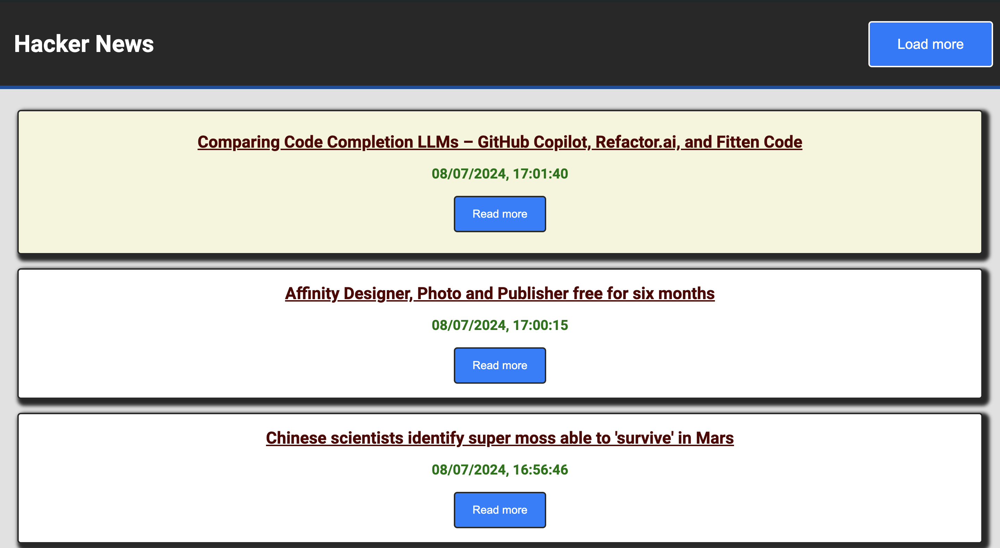

# Hacker News

## Description

#### Application to democratize the dissemination of information in tech through the use of the Hacker News service.

## Software and Tools used

## Functionality

When the page loads, the 10 most recent news will be displayed.

By clicking the **'Load more'** button you can load 10 more, up to a maximum of 500.

For each of the news has been added a button **'Read more'** that allows you to open the link of the resource in a new tab,
so that you do not leave the page and can easily return to consult the news.

## Link

## [Watch Hacker-News-Views](https://hacker-news-views.netlify.app)
